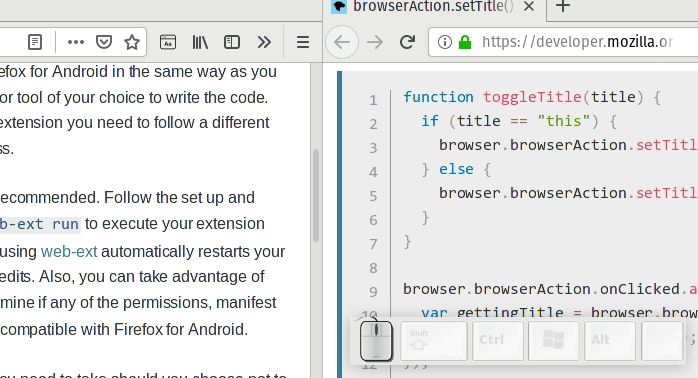

# What is this?

I prefer to use my own fonts instead of fonts set by websites. While firefox provides this configuration, it does not let you easily toggle between browser and website fonts, which is a hassle, because quite a lot of time, I need to use the website fonts (eg: fonts.google.com).

This Firefox WebExtension lets you toggle between browser and website fonts by:

1. clicking on the toolbar icon
2. pressing keyboard combo: Alt-Comma

The toolbar icon also acts as a visual cue: If it is coloured, then browser fonts are enforced. Otherwise, website fonts are being used. The icon tooltip provides the textual cue for the same.

# Demo




# NEW in Version 1.0

1. The user can now specify in the addon preferences which fonts - the browser fonts or the website fonts - should be enforced for all websites by default.

2. Enforcing browser/website fonts now operates at per-website-domain level, instead of the global level. A website domain by default uses the fonts set in the add-on preferences. If the user switches the fonts from the default for that domain, then the add-on will remember that change for that domain.

# Roadmap

- [x] Customizable keyboard shortcut
  Firefox now lets the user to set a custom keyboard shortcut for each add-on
- [x] **Now available from v1.** Configuration per website. As such, Firefox's setting is browser-wide. But I see a possibility of piping through the various extension APIs to make per-website configuration possible.

# Current Limitations

- ~~Firefox stores this configuration browser-wide, not per-site. There is a way to emulate per-site enforcement, which is a milestone in the roadmap.~~ **Now available from v1**
- Firefox has not (yet) implemented [this API](https://developer.mozilla.org/en-US/docs/Mozilla/Add-ons/WebExtensions/API/types/BrowserSetting/onChange), without which the addon cannot detect when user toggles the document fonts outside of addon, from browser preferences. Hence, the addon icon will go out of sync, at least until user uses the addon to toggle the fonts, or restarts the browser. This is not such a major annoyance, but worth mentioning anyway.


# Credits

- In-use icons:
<div>
    Icons made by
    <a href="https://www.flaticon.com/authors/baianat" title="Baianat">Baianat</a>
    from
    <a href="https://www.flaticon.com/" title="Flaticon">www.flaticon.com</a>
    is licensed by
    <a href="http://creativecommons.org/licenses/by/3.0/" title="Creative Commons BY 3.0" target="_blank">CC 3.0 BY</a>
</div>

- Backup icons:
<div>
    Icons made by
    <a href="https://www.freepik.com/" title="Freepik">Freepik</a>
    from
    <a href="https://www.flaticon.com/" title="Flaticon">www.flaticon.com</a>
    is licensed by
    <a href="http://creativecommons.org/licenses/by/3.0/" title="Creative Commons BY 3.0" target="_blank">CC 3.0 BY</a>
</div>

# Dev Only

Commands used during development are listed here for personal use and for general reference:

```shell script
# to compile core.js
clj --main cljs.main --compile-opts cljs-compile-options/dev/core.edn --watch src --compile ebf.core

# to compile preferences.js
clj --main cljs.main --compile-opts cljs-compile-options/dev/preferences.edn --watch src --compile ebf.preferences

# to run web-ext in dev mode
web-ext run  --browser-console --pref font.name.monospace.x-western="JetBrains Mono" --pref font.name.sans-serif.x-western="JetBrains Mono" --pref font.name.serif.x-western="JetBrains Mono"
```